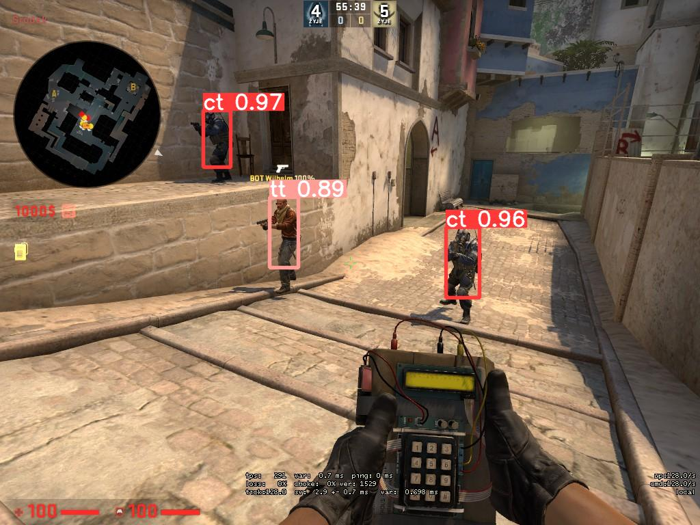
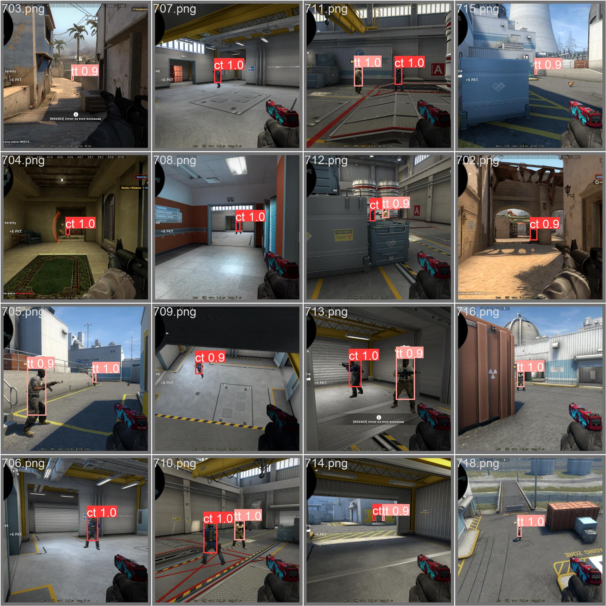
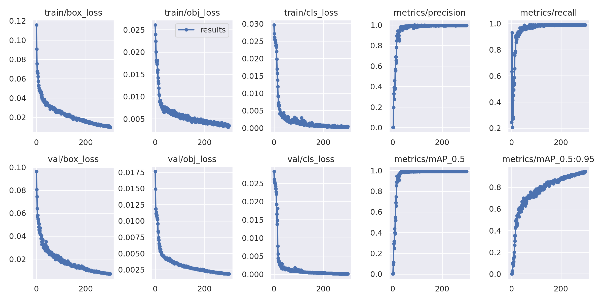

# csgo-object-detection

Program using Yolov5 to detect player objects in csgo

## Preview

## Docs

`main.ipynb` - is used for training custom data.

`tools/screenshoter` - program that helps prepare images for training

`model/weights` - my model

`detector` - object detection soft

### How to use

1) (optional) run `main.ipynb` in google colab and load your custom data.
2) download your generated weights (`best.pt` or `last.pt`) or use mine in the `model/weights`
3) download yolov5 repo - `git clone https://github.com/ultralytics/yolov5.git`
4) Install dependencies `pip install -r yolov5/requirements.txt` and `pip install -r requirements.txt`
5) Run `detector/detector.py`